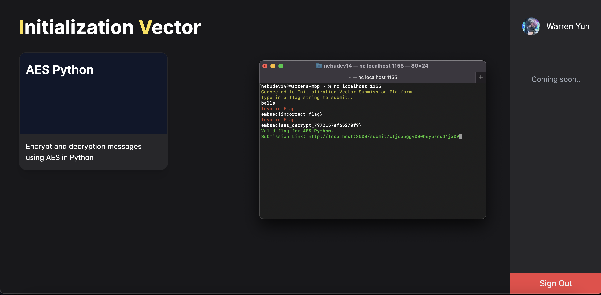
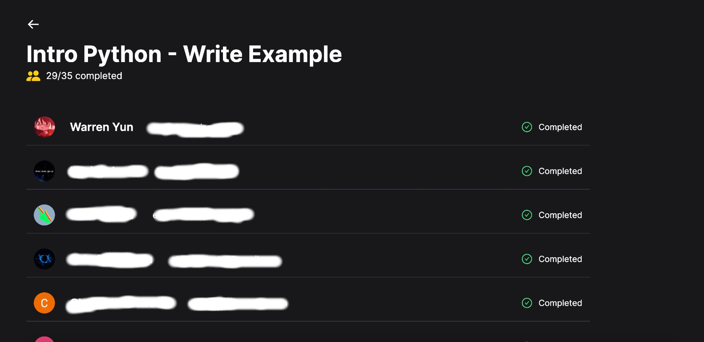
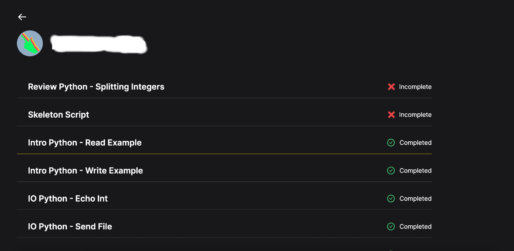

# Initialization Vector

## What is this?
This is a neat little tool I ended up making in about a week for MIT BWSI's Embedded Security and Hardware Hacking course. It primarily serves as a way for students to submit flags received from completed labs, and for instructors to track which students have completed which labs and vice versa.

This repository houses the web app that allows students to view labs and their completion status.

## How does it work?
When completing labs, users are greeted with a **flag string** representing whether their solution is correct or not. A flag string is formatted like `embsec{blah_123blah_431_warren}`.

Once this flag has been received, students can use [netcat](https://netcat.sourceforge.net/) to establish a TCP connection with the [listener](https://github.com/NebuDev14/init-vector-listener) hosted on a server. Students can paste their flag string and send it over for validation, and if correct, will receive a unique submission link where they can officially mark their lab as completed.

Initialization Vector also comes packaged with tools for instructors to monitor student progress.

## Why is it named Initialization Vector?

1. It is named after [Initialization Vectors](https://en.wikipedia.org/wiki/Initialization_vector) found in ciphers such as AES to ensure that encrypting the same message with the same key can result in different outputs.
2. It is coincidentally, also named after [Iv](https://github.com/aerobinsonIV), one of the lead instructors of the course, and also an all around cool guy.

## Setup and installation

This project was kickstarted using the [T3 stack](https://create.t3.gg/). You can re-create the setup on your local computer by downloading this project:

    $ git clone https://github.com/nebudev14/initialization-vector.git

This project depends on environment variables for production. For an example, check `.env.example` in the root directory. You'll need to setup Google OAuth, for some of these keys, which you can do [here.](https://console.cloud.google.com/cloud-resource-manager)

Start up the local Postgres database using Docker:

    $ docker compose up

Install dependencies: 

    $ yarn

Migrate Prisma schema to the existing Postgres database:

    $ yarn prisma migrate dev

Run the development server:

    $ yarn dev

If you're interested in also running the listener that works with this project, follow the setup instructions [here.](https://github.com/NebuDev14/init-vector-listener)

## Contributing

Unfortunately, this project is not receiving any outside contributions any time soon. If you're a part of the MIT BWSI Embsec course staff and would like to make changes, please reach out to me at `hi@wyun.dev`. Thanks!